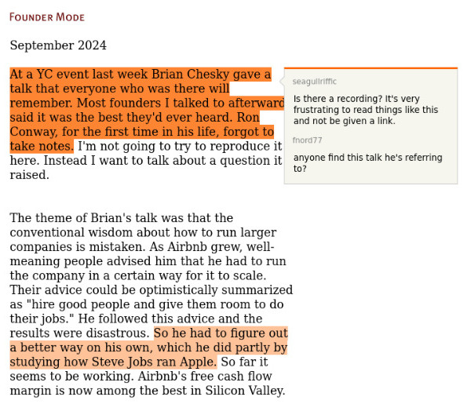
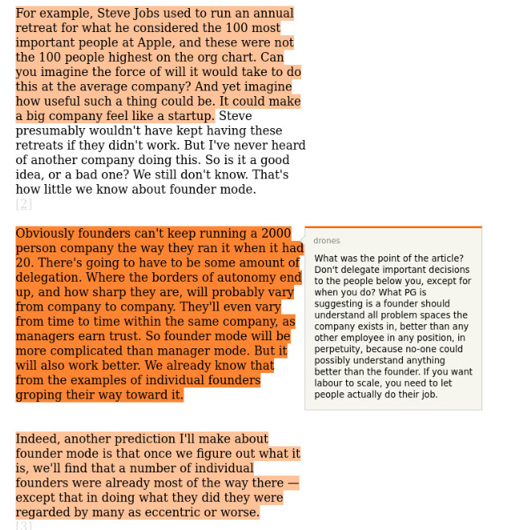
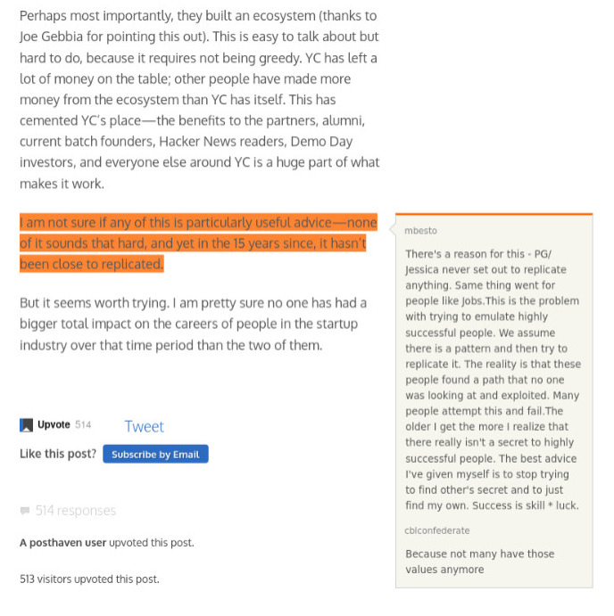

# HN Inline
## an experimental inline quote highlighter

When clicking links on HN, comments that quote the article are highlighted.

### inside
The content script listens for a click on an article and then messages the background script with the URL and submission ID. The comments are then retrieved from the Algolia API and then sent to an injected script to find and highlight the quotes/comments.

because of the permissions required to work, i probably won’t package this up and distribute it. If you would like to use it in chrome, you can easily add the extension from the source folder, firefox makes it a little more tricky, it can be built using web-ext, i use it from here: https://addons.mozilla.org/en-US/firefox/addon/hn-inline/

there is a bug when quotes overlap but apart from that I am happy with the success rate.

